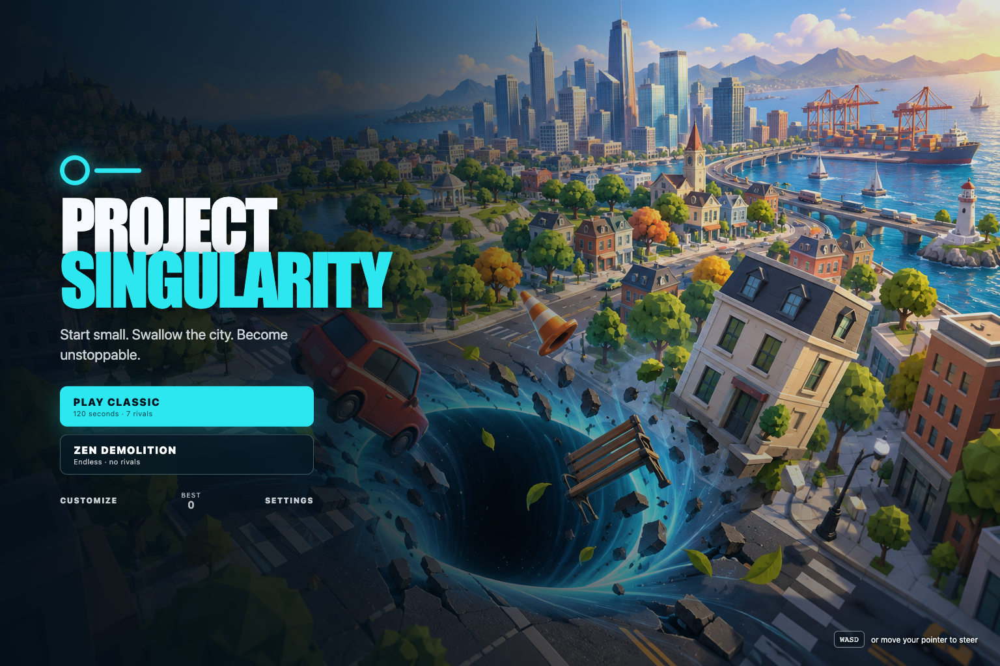
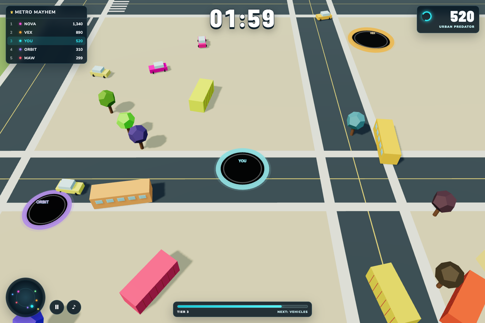
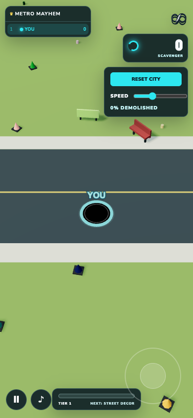

<div align="center">

# PROJECT SINGULARITY

### Start small. Swallow the city. Become unstoppable.

[](https://frankiejvaldez.com/HoleIO/)
[](https://github.com/frankstop/HoleIO/actions/workflows/deploy-pages.yml)
[](https://www.typescriptlang.org/)
[](https://threejs.org/)
[](LICENSE)

A polished browser arcade game inspired by the scale rush of city-eating classics. Pilot a mobile gravitational void through a colorful miniature metropolis, consume anything that fits, outgrow seven hungry rivals, and reach skyscraper scale before time expires.

[Play the live game](https://frankiejvaldez.com/HoleIO/) · [Report a bug](https://github.com/frankstop/HoleIO/issues/new)



</div>

## The game

Every match starts at street-litter scale. Cans and traffic cones become benches, cars become buses, and eventually entire homes and towers collapse into the void. Your radius changes your speed, camera distance, edible targets, and relationship with every rival on the map.

- **Eight growth tiers** spanning tiny litter through colossal skyscrapers
- **Tactile ingestion** with suction, acceleration, tumbling, shrinking, and tier-scaled feedback
- **Seven autonomous rivals** that forage, hunt, flee, collide, score, and respawn
- **Hole-versus-hole predation** with size thresholds, score transfer, death penalties, and ghost shields
- **Four city districts** built for different progression phases: park, suburbs, downtown, and harbor
- **Procedural soundscape** with adaptive music, ingestion sounds, countdown cues, and victory stings
- **Persistent progression** for best score, unlocked tiers, and cosmetic rim selection



## Modes

| Mode | Rules |
| --- | --- |
| **Classic** | A 120-second free-for-all against seven AI rivals. Highest score wins. Devoured players lose 30% of their score, reform after four seconds, and return with a temporary shield. |
| **Zen Demolition** | Endless solo play with no rivals, a live demolition percentage, city reset, and adjustable 0.5×–2× simulation speed. |

## Controls

| Input | Control |
| --- | --- |
| Keyboard | `WASD` or arrow keys |
| Mouse | Move the pointer away from screen center |
| Touch | Drag anywhere for the floating joystick |
| Gamepad | Left analog stick |
| Pause | `P`, `Escape`, or the HUD pause button |

The interface includes sound controls, reduced-motion support, high-contrast mode, responsive safe areas, and a compact mobile HUD.

<p align="center">
  
</p>

## Run locally

Requirements: Node.js 20 or newer and npm.

```bash
git clone https://github.com/frankstop/HoleIO.git
cd HoleIO
npm install
npm run dev
```

Vite prints the local URL when the development server is ready.

## Production and tests

```bash
# Type-check and create the optimized production build
npm run build

# Run the gameplay logic test suite
npm test

# Preview the production build locally
npm run preview
```

The optional `?showcase=1` URL parameter starts Classic mode at the Tier-3 visual benchmark after you press Play. Normal play always starts at Tier 1.

## Architecture

```text
src/
├── game/
│   ├── audio.ts    Procedural Web Audio soundtrack and feedback
│   ├── config.ts   Tiers, props, rivals, skins, and match constants
│   ├── game.ts     Match lifecycle, AI, ingestion, combat, and camera
│   ├── input.ts    Keyboard, mouse, touch, and gamepad controls
│   ├── logic.ts    Pure progression and rules helpers
│   └── world.ts    Low-poly city, props, districts, and hole rendering
├── main.ts         UI shell, HUD, menus, radar, and persistence
└── style.css       Responsive visual system and accessibility modes
```

The game uses Three.js for the real-time WebGL scene and a deterministic custom simulation for movement, suction, ingestion, growth, AI decisions, and combat. UI remains code-native HTML/CSS for crisp rendering and accessibility.

## Design principles

- Immediate play with no account, download, or tutorial gate
- Strong visual distinction between edible and oversized targets
- Continuous scale feedback through radius, camera, audio, and score
- Fully local gameplay with no analytics, tracking, or backend dependency
- Graceful keyboard, pointer, touch, and controller input from one build

## Contributing

Issues and focused pull requests are welcome. Before opening a pull request, run:

```bash
npm run build
npm test
```

## License

Released under the [MIT License](LICENSE).
